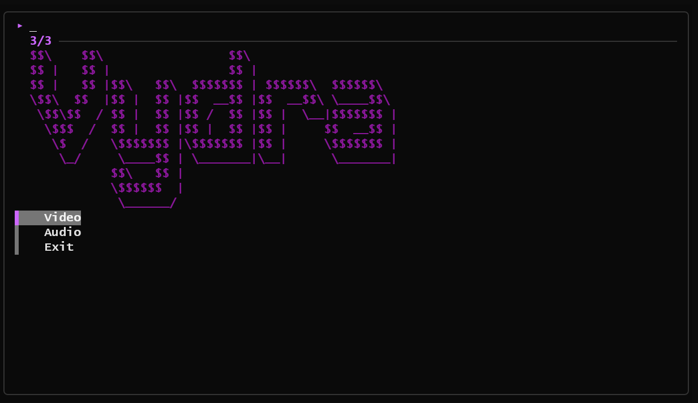

<p align="center">
  
</p>

<p align="center">
  <b>A lightweight, zero-dependency CLI media downloader</b><br>
  Download videos & audio from YouTube, TikTok, Instagram, Twitter/X, and 1000+ sites.<br><br>
  
  
  
  
</p>

---

## Screenshots

<p align="center">
  
  <br><br>
  
</p>

---

## Features

- **Single executable** — no setup, no installs, just run it
- **Auto-install** — yt-dlp & ffmpeg downloaded automatically on first run
- **Beautiful purple UI** — powered by fzf with a clean terminal aesthetic
- **Quality picker** — choose between Best, 1080p, 720p, 480p
- **Audio extraction** — MP3, M4A, Opus, FLAC, WAV
- **Format selection** — MP4, MKV, WebM
- **Winget-style progress** — live progress bar with speed & ETA inside fzf
- **Smart platform detection** — recognizes YouTube, TikTok, Instagram, Twitter, and more
- **Auto-open** — file opens automatically when download completes

---

## Download

| Platform | Link |
|----------|------|
| Windows  | [`dl-cli.exe`](https://github.com/imaan-jaman/dl-cli/releases) |
| Linux    | [`dl-cli-linux`](https://github.com/imaan-jaman/dl-cli/releases) |

Dependencies are downloaded automatically on first run.

---

## Quick Start

1. Download the binary for your platform from [Releases](https://github.com/imaan-jaman/dl-cli/releases)
2. Run it — dependencies install automatically on first launch
3. Paste a link, pick quality, done

---

## Usage

```
vydra                   Launch interactive menu
vydra <url>             Direct download (best quality)
vydra <url> -a          Audio only (MP3)
vydra <url> -q 2        Quality level (1=Best, 2=1080p, 3=720p, 4=480p)
vydra <url> --fmt mkv   Output format
vydra <url> -o ./dir    Output directory
```

---

## How It Works

```
Paste URL  -->  Pick Quality  -->  Pick Format  -->  Download  -->  Open File
   |               |                   |                |              |
   fzf             fzf                 fzf          winget-style      fzf
  input           picker             picker          progress        confirm
```

Vydra wraps [yt-dlp](https://github.com/yt-dlp/yt-dlp) with a polished terminal UI. On first run it auto-downloads yt-dlp and ffmpeg — no manual setup needed.

---

## Supported Sites

YouTube, TikTok, Instagram, Twitter/X, Twitch, Vimeo, Dailymotion, Reddit, Facebook, SoundCloud, Bandcamp, and [1000+ more sites](https://github.com/yt-dlp/yt-dlp/blob/master/supportedsites.md).

---

## Requirements

| Platform | Min Version |
|----------|-------------|
| Windows  | 10+ (terminal with ANSI support) |
| Linux    | Any modern distro |

- Terminal with ANSI color support (Windows Terminal, PowerShell 7+, kitty, alacritty, etc.)
- `fzf` is bundled / auto-installed

---

## License

MIT
